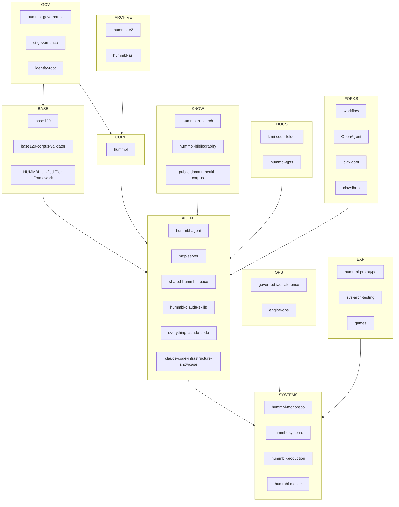

# HUMMBL Repo Topology & Dependency Graph (Living)

> **Purpose**: Organize all HUMMBL repos and show how they relate.  
> **Status**: Living document.

---

## Context Log

- **Date**: 2026-02-05
- **Time (ET)**: 16:50:23 EST
- **Location**: Atlanta, GA
- **Source**: User-provided repo list + current `kimi-code-folder` context
- **Owner**: hummbl-dev
- **Notes**: This file is a living artifact; update when repos change.

### Audit Log

- **2026-02-05 16:52:08 EST** — Audit pass to align topology with current repo list.

---

## Dependency Graph (Conceptual)

---

## Repo Inventory (Grouped)

### Core Standards & Governance
- **hummbl-governance**
- **ci-governance**
- **identity-root**
- **base120**
- **base120-corpus-validator**
- **HUMMBL-Unified-Tier-Framework**

### Core HUMMBL Framework
- **hummbl**

### Agent & Orchestration Layer
- **hummbl-agent**
- **mcp-server**
- **shared-hummbl-space**
- **hummbl-claude-skills**
- **everything-claude-code**
- **claude-code-infrastructure-showcase**

### Product & Systems
- **hummbl-monorepo**
- **hummbl-systems**
- **hummbl-production**
- **hummbl-mobile**

### Knowledge & Research
- **hummbl-research**
- **hummbl-bibliography**
- **public-domain-health-corpus** *(private)*

### Docs & Standards for Agents
- **kimi-code-folder**
- **hummbl-gpts**

### Infrastructure & Ops
- **governed-iac-reference**
- **engine-ops**

### Experiments & Prototypes
- **hummbl-prototype**
- **sys-arch-testing**
- **games**

### External Forks / References
- **workflow**
- **OpenAgent**
- **clawdbot**
- **clawdhub**

### Legacy / Archive
- **hummbl-v2** *(private, archive)*
- **hummbl-asi** *(private, archive)*

### Private / Internal (Not Public)
- **public-domain-health-corpus**
- **Poe-bots**

---

## Update Instructions (for agents)

1. Add new repos to the appropriate group.
2. Update graph edges if dependencies change.
3. Log any structural changes in **Context Log**.
4. Mark repos as **private**, **archived**, or **forked** where applicable.

---
